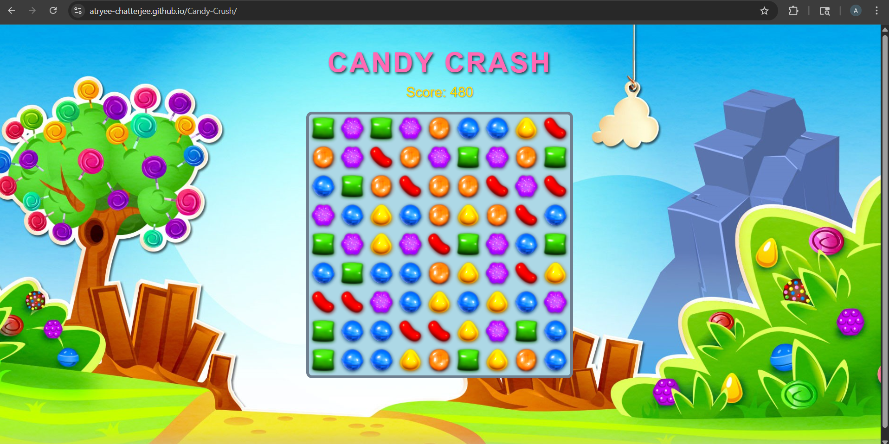

# 🍬 Candy Crush Clone Game
## 🧾 About

A **Candy Crush–style Match-3 game** built using **HTML, CSS, and Vanilla JavaScript**, featuring smooth drag-and-drop interactions, real-time match detection, gravity-based tile movement, and score tracking.

🚀 **Live Demo:**
 https://atryee-chatterjee.github.io/Candy-Crush/

---

## 📸 Preview

  

---

## 🚀 Features

* Drag & Drop candy swapping
* Match detection (3, 4, 5 patterns)
* Score-based candy crush system
* Gravity effect for dynamic gameplay
* Continuous game loop
* Mobile-friendly and responsive design
* Smooth and interactive UI experience

---

## 🛠️ Tech Stack

* **Frontend:** HTML, CSS, JavaScript
* **Logic:** Vanilla JavaScript

---

## 👩‍💻 Author

**Atryee Chatterjee**

* GitHub: https://github.com/Atryee-Chatterjee
* LinkedIn: www.linkedin.com/in/atryee-chatterjee

